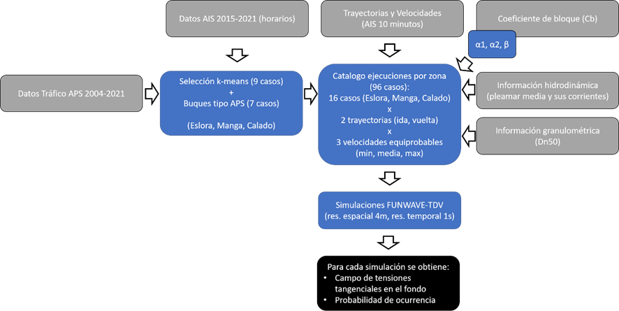
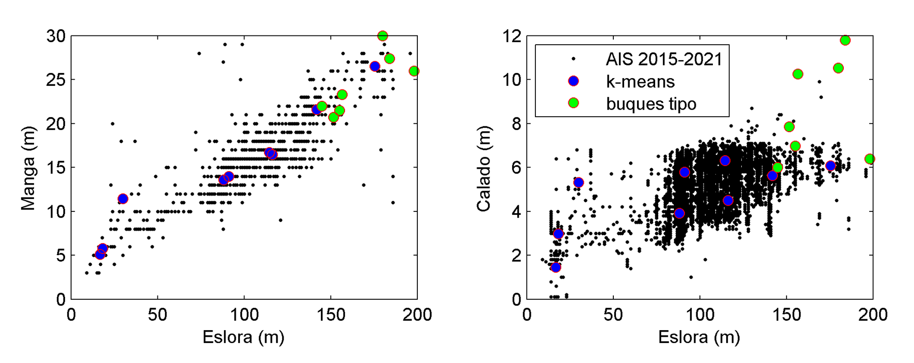

# Hydrodynamic Study of Ship Passage Effects

## Introduction

This study analyses the hydrodynamic impact of the passage of ships in the Guadalquivir estuary, with special attention to their capacity to mobilise sediments from the seabed. The effects of maritime traffic are compared with natural environmental forcings, using advanced numerical models (Delft3D and FUNWAVE-TDV) to simulate the tangential stresses on the seabed.

## Methodology

The general methodology of the project is as follows:

Based on the general overview of the study, this report will go in depth into the ship selection module, which is based on artificial intelligence techniques, namely the k-means algorithm.

## Vessel selection using k-means

One of the key aspects of the study is the application of artificial intelligence techniques to efficiently represent the diversity of the fleet. The k-means clustering algorithm, an unsupervised machine learning technique, was used to group vessels according to their geometric characteristics: length, beam and draught.

* Clustering objective: to identify a reduced set of vessels that represent the structural variability of the entire fleet that has transited the Eurovía del Guadalquivir between 2015 and 2021.
* Input data: AIS (Automatic Identification System) records with vessel dimension information.
* Number of clusters (k): 9 clusters were selected, each representing a vessel type. The centroid of each cluster defines a representative vessel.

This approach made it possible to construct a first set of 9 representative vessels, complemented by a second set of 7 standard vessels defined by the Seville Port Authority, selected for their operational relevance.

## Conclusions

* Reduced model complexity:
The use of the k-means clustering algorithm allowed a significant reduction in the number of simulations required, selecting only 9 representative vessels from thousands of AIS records. This optimised the use of computational resources without compromising the representativeness of the fleet.
* Robust statistical representation:
The technique grouped vessels according to their dimensions (length, beam and draught), generating centroids that capture the structural variability of the fleet. This representation is more objective and reproducible than a manual selection.
* Probabilistic analysis:
By having defined clusters, it was possible to calculate the frequency of occurrence of each vessel type, allowing the hydrodynamic results to be appropriately weighted according to their actual probability of occurrence.
* Scalability and applicability:
The k-means-based methodology is easily scalable to other ports or river contexts, provided that AIS data are available. This makes it a versatile tool for environmental impact studies or port planning.

