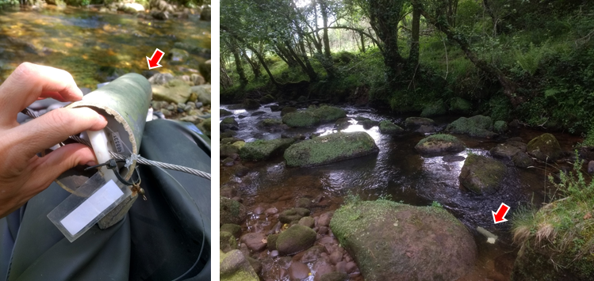
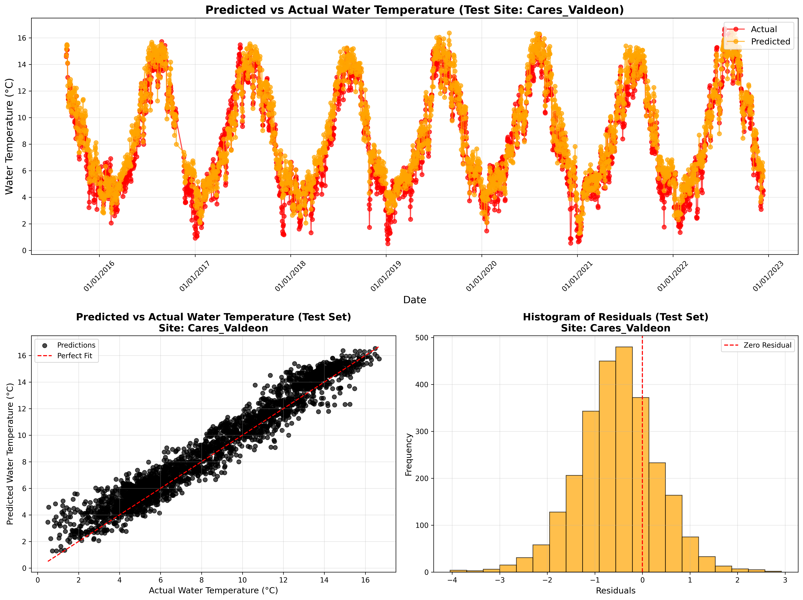

# IA4WATER - Modelling Water Temperature Using AI and Global, Open-access Environmental Data 
#rivers #water #temperature #machine learning #land use change #climate change

## Context

Stream temperature is a critical water quality determinant, influencing the spatial distribution of aquatic organisms and biological processes (Cassie, 2006). Climate change and land use change alter the drivers of stream temperature, the structure of stream systems (e.g., riparian forest degradation), or both, modifying natural stream temperature. However, we lack temperature data for most streams, and stream temperature data in the absence of human activity is particularly scarce in space and time. This hampers our ability to detect and quantify changes in stream temperature and evaluate global change impacts on rivers and associated ecosystems. 

## Description

Using the open-source AutoML library (Amazon Web Services), we developed a simple code to build high-quality machine learning-based models to predict water temperature in time and space. The models were trained with short to medium-term time series of *in situ* water temperature measurements (Figure 1) and environmental predictors such as topography, river reach structure (elevation, draining area, distance to outlet), climatic variables from EMO-1 (European Commission, JRC) and land use data from CORINE Land Cover 2018 (COPERNICUS Land Monitoring Service).  

<figure align="center">
   
   <figcaption><i>Figure 1 - Water temperature sensor and location in-stream.</i></figcaption>
</figure>

##

Model fit was as good as R2=0.97 and RMSE=0.65 for the location were water temperature was best predicted (Figure 2).

<figure align="center">
   
   <figcaption><i>Figure 1 - Water temperature prediction and model fit.</i></figcaption>
</figure>

## Highlights

* Water temperature can be accurately and easily predicted combining machine learning techniques and available data from global, open-access products
* Machine learning techniques such as random forests and neuronal networks can deal reasonably well with short to medium-term time series and potentially autocorrelated predictor variables to predict water temperature
* This modelling approach allows to fill temporal and spatial gaps in water temperature data, improving our capacity to assess the impacts of changes in climate and land use change on river conservation status and the subsequent effects on aquatic biodiversity

## Insights

* Using global, open-access products opens up the possibilities of predicting water temperature in any region and making projections with future climate data
* Water resource and environmental managers can improve conservation and restoration strategies at the basin and regional scale
