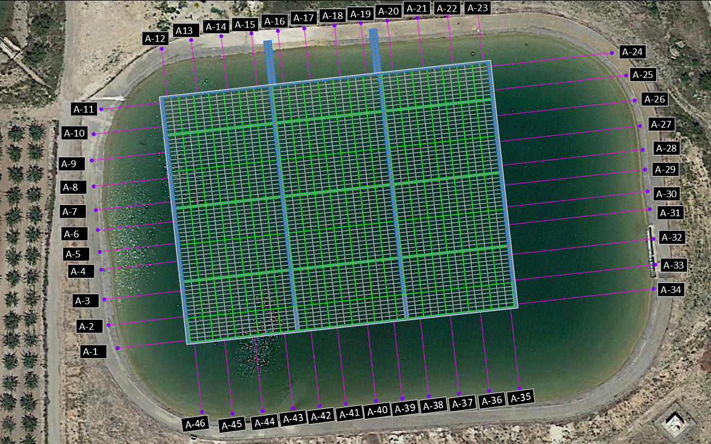

## INTELIGENTE - Machine Learning tool for predicting FPVP movements and fatigue-based damage

`#predictive-maintenance` `#machine-learning` `#metocean` `#energy` `#photovoltaics` 

---
### Context
The rapid expansion of solar photovoltaic technology has highlighted the potential of floating photovoltaics (FPVs) to address land use limitations while providing additional environmental benefits. However, maintaining critical mooring systems that ensure FPV stability remains challenging, especially under environmental loads such as wind and waves.

<figure align="center">
    
    <figcaption><i>Figure 1 - View of the studied plant</i></figcaption>
</figure>

### Description
This study explores the application of machine learning (ML) methods for predicting the dynamic behaviour of FPV systems installed on irrigation ponds, with a focus on mooring tension, platform movements and fatigue based damage. Using a dataset derived from numerical modeling trained with historical wind and water depth data, two ML algorithms, the random forest and XGBoost, were employed to develop predictive models.

The main highlights of this project are metinoned below: 
1. A thorough case selection has been designed, in order to properly train the models with representative environmental states. This has used a combination of the MaxDiss algorithm and Convex Hull.
2. The use of Machine Learning algorithms to predict the movements of the plant related to specific metocean states. The proposed algorithms are Random Forest, XGBoost, AdaBoost and an ensemble model to combine all the previous ones.
3. A damage estimation caused by the cyclic tensions the mooring systems are subjected to. This is based on the SN Curves damage estimations, the Palmgren-Miner rule and the rainflow cycle counting algorithm.

### Insights
* Although the tensions are movements are rather easily predicted, the damage has proven to present more difficulties due to its more erratic nature.
* Apart from working as a predictive maintenance tool, when the models are properly calibrated, it would be possible to use the systems as a design tool too.

### Other Remarks
* Object of two scientific publications (still in review process).
* This project was founded by ISIGENERE and the NextGeneration funds from the EU.

