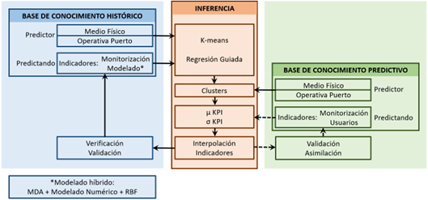
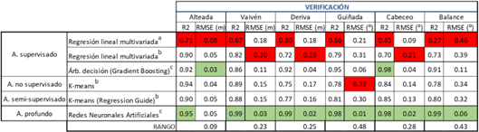
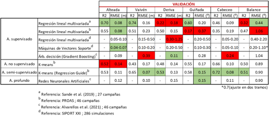

# PROAS ALGECIRAS

## Introduction

The PROAS Algeciras Project aims to develop an advanced system for predicting ship-infrastructure operability in port environments, based on artificial intelligence techniques. Its main goal is to improve the safety, efficiency, and comfort of port operations through the analysis of key performance indicators (KPIs). These indicators cover aspects such as reliability, safety, efficiency, and comfort, with applications in berthing maneuvers, loading and unloading operations, and moored ship response.

## Methodology

Indicator Identification:

Key indicators associated with reliability (mooring tension, fender compression and bollard tension), safety (berthed vessel movements, deviation from desired trajectory in approach manoeuvre, port entry/exit and ferry berthing, quality of navigation and visibility), efficiency (productivity, loading time/net hand time, net berthing/mooring time, operability (operational windows) and quality of navigation) and comfort (movements of the berthed vessel, deviation from the desired trajectory in the approach manoeuvre, entry/exit to port and berthing of ferries, quality of navigation and visibility).

## Knowledge Base:
* Historical and predictive port data (planned operations, ocean-meteorological information, and characterization of Areas of Interest - AOIs).
* Moored ship system response (including reliability, safety, efficiency, and comfort indicators).
* User feedback (on operational development, thresholds, and stakeholder identification).

## Predictive Tool Design:
* Use of learning algorithms.
* Data normalization to standardize predictive variables.
* Definition of specific models for each indicator based on the operational areas of interest (AOIs).

## Inference and Machine Learning:
* Continuous model adjustment through feedback and database expansion.
* Validation and calibration of defined operational thresholds.

## Validation

The methodology was validated using data from the outer port of Langosteira (A Coruña), with measurements of ship movements in six degrees of freedom. Data from 46 field campaigns were used.

## Conclusions

* The semi-supervised learning technique based on k-means with guided regression is well-suited for predicting port operability indicators.
* The tool’s flexibility allows its application in various ports and scenarios, supporting its adoption as a universal decision-support system.
* Continuous validation and self-learning ensure progressive improvements in prediction accuracy, establishing the system as a robust solution for port operational management.
* Applying this methodology in real-world scenarios will significantly enhance safety and efficiency in port environments.

## Bibliography 

Romano-Moreno, E.; Tomás, A.; Diaz-Hernandez, G.; Lara, J.L.; Molina, R.; García-Valdecasas, J. A (2022). Semi-Supervised Machine Learning Model to Forecast Movements of Moored Vessels. J. Mar. Sci. Eng. 2022, 10, 1125.
[**LINK**](https://doi.org/10.3390/jmse10081125)

