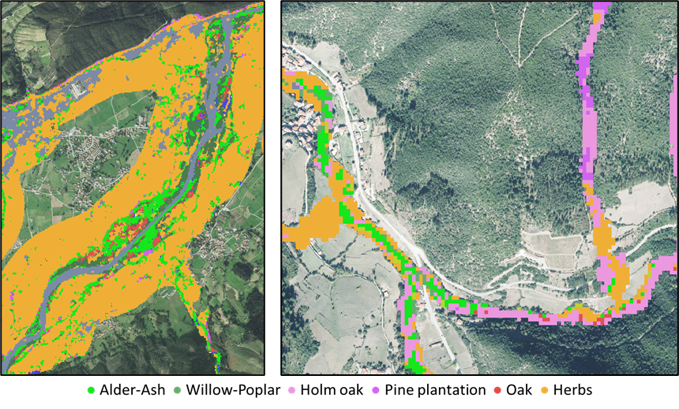
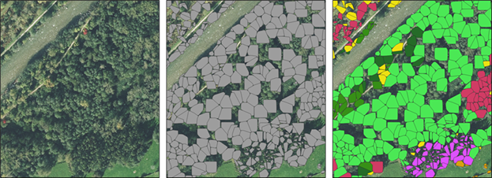
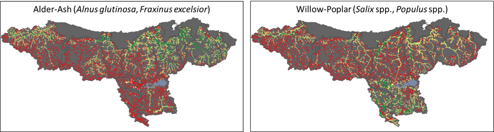
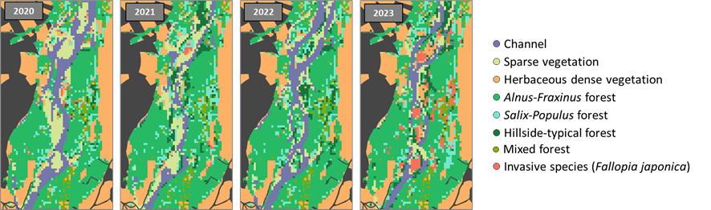

# RiparIAn forests - Mapping riparian vegetation formations along Cantabrian river networks 
#remote-sensing #phenology #random-forest #sentinel-2

## Context

Riparian areas play key ecological roles within the landscape matrix, distributed along a network structure and connecting hillsides and river channels, as well as mountain areas and lowlands. Furthermore, they are highly dynamic systems subject to frequent natural and anthropogenic disturbances. Therefore, it is necessary to assess their status across large and continuous spatial and temporal scales. In order to fulfil this need, multispectral images and time-series analysis arise as practical tools to model the distribution of different formations along the riparian corridor.

<figure align="center">
   
   <figcaption><i>Figure 1 -Riparian forest pixel-level classification..</i></figcaption>
</figure>

## Description

The input data are georeferenced training points with habitat type information, which are expanded by photointerpretation. Random Forest models are trained with these points, LiDAR point clouds, and a set of phenological indicators extracted from fitted harmonic curves of different bands and spectral indices (Land Surface Phenology). Pixel-level classifications are carried out at different class-aggregation scales. Moreover, the availability of LiDAR point clouds allows for tree-level classifications, and time series analysis allows for multitemporal modelling.

<figure align="center">
   
   <figcaption><i>Figure 2 - Riparian forest tree-level classification.</i></figcaption>
</figure>

##

<figure align="center">
   
   <figcaption><i>Figure 3 - Modelled distribution of two forest types along river networks.</i></figcaption>
</figure>

## Insights

* Scientific and management applications. 
* Multitemporal modelling helps tracking the evolution of riparian formations and fluvial hydromorphology, as well as biological invasions.
* Deep Learning tools will applied through ArcGIS Pro to improve the detection of different riparian habitats.

<figure align="center">
   
   <figcaption><i>Figure 4 -  Multitemporal pixel-level modelling.</i></figcaption>
</figure>

