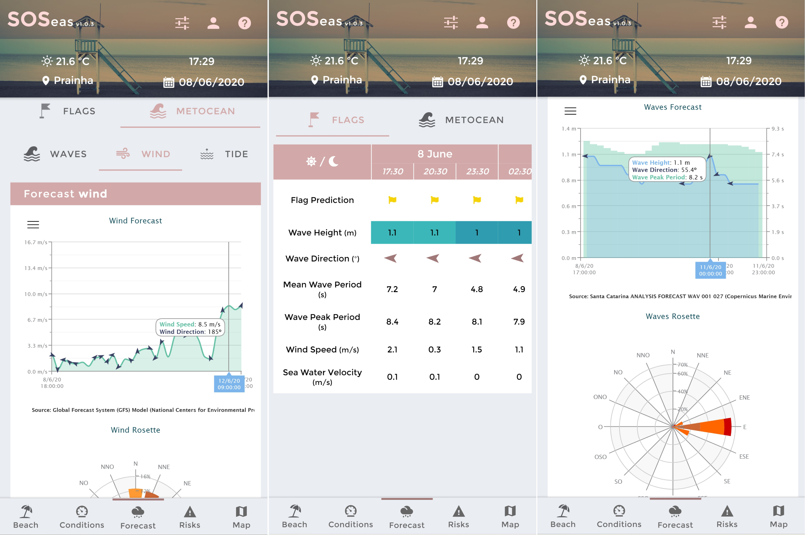
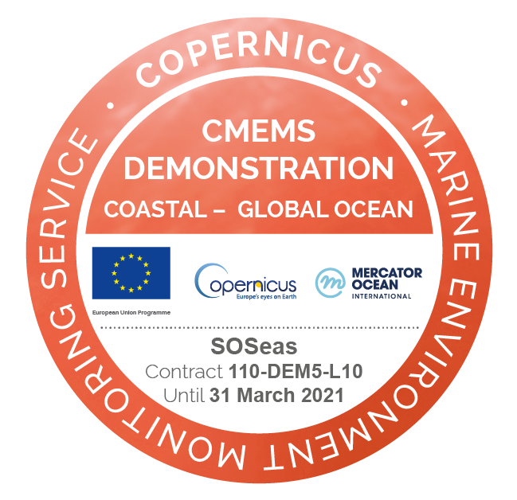

# SOSeas - Assessment Tool for Predicting the Dynamic Risk of Drowning on Beaches

🏖️🛟🚩 `#electronic-flag` `#drowning` `#metocean` `#beach-safety` `#neuronal-network` `#deep-learning`

---

## Context

Despite significant advances in science, technology, and coastal management, drowning remains a leading cause of accidental death on beaches. In Latin America, Brazil presents one of the highest drowning indices — with one drowning every 91 minutes. Against this backdrop, the following question arises:

> Can we develop a global operational system to inform beachgoers and managers of drowning risks on both patrolled and unpatrolled beaches?

{fig-align="center"}

---

## Description

**SOSeas** is a cutting-edge application developed to predict and reduce drowning risk while improving the dissemination of relevant information for beach users, lifeguards, and managers.

Its main innovation is the **electronic bathing flag**, which reflects the dynamically predicted drowning risk at any given beach.

### Key Features

1. **Cross-analysis** of metocean conditions, beach morphology, and historical flag event data.
2. Use of **deep learning** techniques (Deep Neural Networks) to predict drowning risk based on real-time environmental data.
3. **Electronic flag system** to communicate risk levels to the public.
4. **User-centric interface** including:
   - Forecast of winds, waves, currents, and tides.
   - Maps of beach characteristics and services.
   - Warnings for hazards such as jellyfish or harmful algal blooms.

{fig-align="center"}

---

## Insights

- 🛟 **Enhanced Safety:** Lifeguards, managers, and beachgoers receive predictive, dynamic risk information to improve situational awareness.
- 🌊 **Proactive Management:** Forecasting allows better planning, prevention strategies, and more efficient beach safety resource allocation.

---

## Other Remarks

- 📄 **Scientific Publication:** [doi:10.5194/egusphere-egu2020-18033](https://doi.org/10.5194/egusphere-egu2020-18033)
- 🌏 **International Implementation:** A version of the tool was also deployed in Australia *(reference pending)*.
- 💰 **Funding:** Project funded by **CMEMS DEMONSTRATION COASTAL-GLOBAL OCEAN**  
  *(Contract: 110-DEM5-L10)*

{width="150" style="float: right;"}

---

{width="500px" fig-align="center"}
