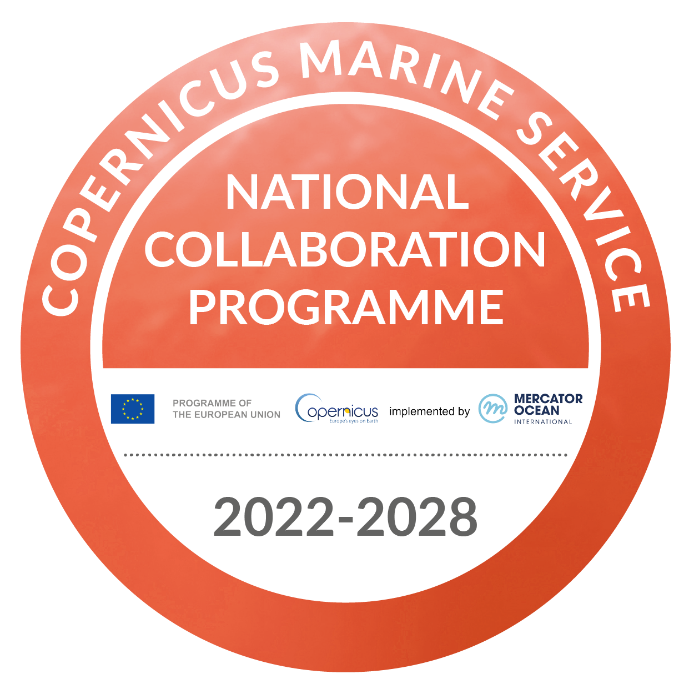

## Santander OEFS AI - Santander Operational Estuary Forecast System based on AI

`#operational-system` `#forecasting` `#hydrodynamic-modelling` `#beach-safety` `#neuronal-network` `#deep-learning` `#artificial-intelligence`

---

### Context

Operational systems based on physical modelling are powerful tools to predict and forecast meteo-oceanographic variables. As a counterpart, these tools normally require high computational demands and/or long computational windows to provide results to end users. 

To strike a balance between these requirements and optimal result accuracy, a deep learning neural network has been trained to forecast water levels and current velocity fields in the Bay of Santander.

{width="300px" fig-align="center"}
{width="300px" fig-align="center"}

---

### Description

Based on a calibrated and validated implementation of a hydrodynamic physical model of the Bay of Santander, a system of Long Short-Term Memory (LSTM) neural networks has been trained to replicate the outputs of the physical system.

This AI-based system provides high-resolution water levels and surface currents in **just a few minutes**, as opposed to the hours required by the traditional numerical model.

It can forecast **over 72 hours** of hydrodynamic variables using only predicted time series of the main regional drivers at a single location.

{width="60%" fig-align="center"}

---

### Insights

🌊 **3-day hourly forecasts** of water level and surface currents in the Bay of Santander.  
⏳ **Significant reduction** in resources needed to maintain the system, with reasonable accuracy.  
💡 Enables research in deep learning vs. traditional modelling through intercomparison studies.

---

### Other Remarks

* Developed within the framework of the [PhD thesis of Mirko Rupani](https://ihcantabria.com/en/scientific-production/phd-theses-2/), former member of IHCantabria.
* Scientific publication in progress based on this work.

#### Projects involved:

- [**MARION**](https://ihcantabria.com/en/data-science-and-artificial-intelligence-are-some-of-the-methods-used-by-marion-the-marine-pollution-prevention-system-developed-at-ihcantabria/):  
  Supported by **Ministerio de Ciencia e Innovación** and funded by **NextGeneration EU** through the **ThinkInAzul programme**.

  {fig-align="center" height="75px"}

  {fig-align="center" width="60%" height="50px"}

- [**COSNORTH**](https://ihcantabria.com/en/cosnorth-offers-improved-environmental-maritime-and-climate-services-on-spains-northern-coastline/):  
  Part of the **CMEMS National Collaboration Program** funded by **Mercator Ocean International**.

  {fig-align="center" width="80px"}

  {fig-align="center" width="80px"}

---

{width="500px" fig-align="center"}
