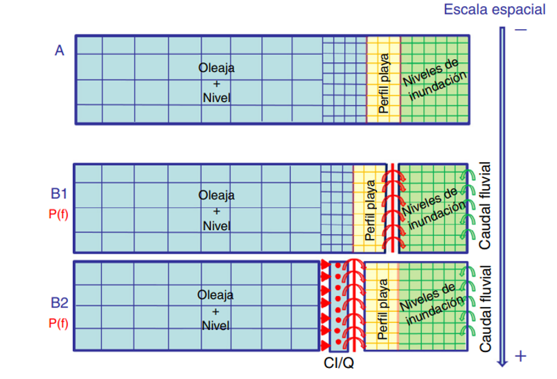
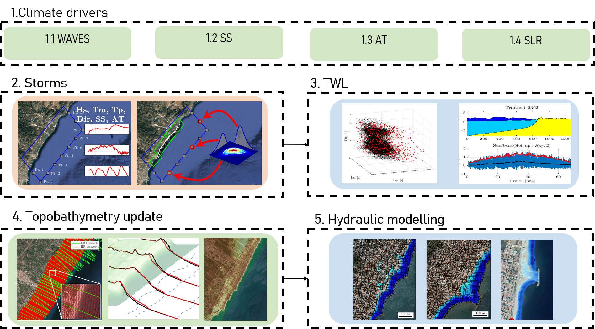
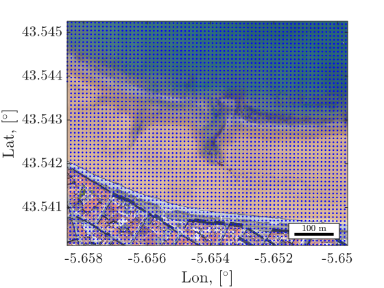
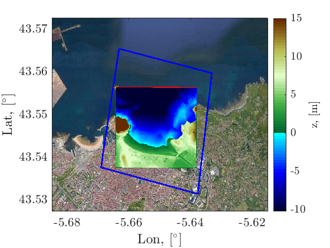
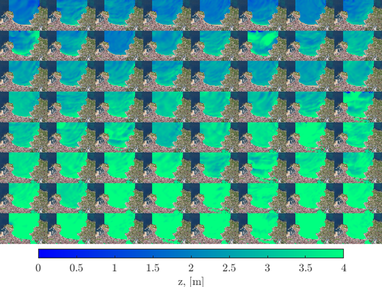
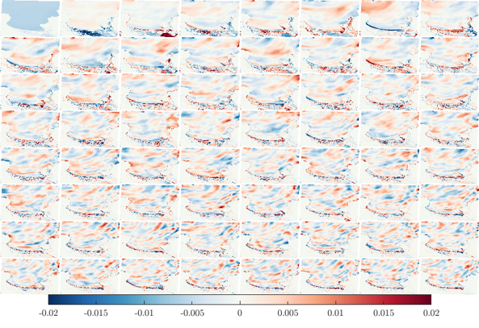
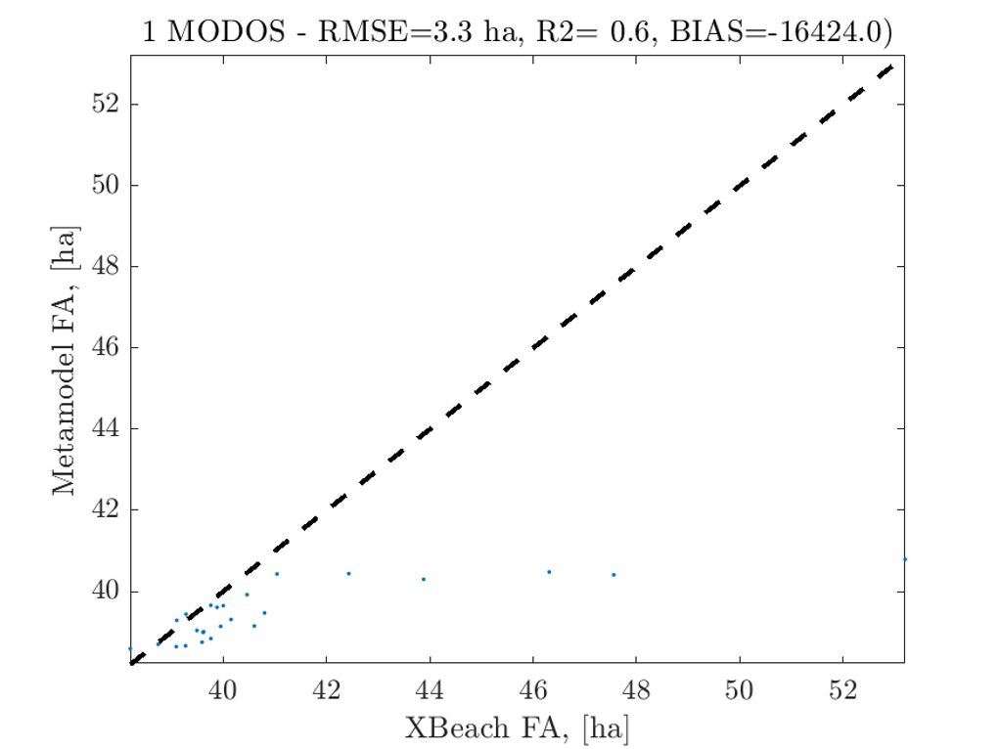

# Machine learning methods for coastal flooding
## Coastal flooding modelling strategies
The choice of the modelling strategy depends on the spatio-temporal scale to be solved. For spatial scales of few hundreds of meters, the direct option is to solve the surfzone hydrodynamics considering waves and water levels and subsequent overland flow using direct numerical simulation. However, for larger spatial scales, the wave and water level transformation problem is uncoupled from the overland flooding simulation to speed up the computations.

  <figure>
    
    <figcaption style="text-align: center;">Figure 1: Coastal flooding modelling strategies.</figcaption>
  </figure>

 

For regional-scale applications, it is usual to solve the surfzone hydrodynamics using specific numerical tools to derive the coastal forcings for a reduced-complexity overland flood model as shown in Figure.

  <figure>
    
    <figcaption style="text-align: center;">Figure 2: Flow diagram for a regional-scale flood modeling applications.</figcaption>
  </figure>

 

## Limitations of numerical flooding prediction
However, in spite of the computational advantages of reduced-complexity process modeling, numerical modeling of coastal flooding has some limitations:
* Computational cost
* Compatibility with operational forecasting systems
* Probabilistic analysis
* Uncertainty analyses

## Problem statement
In order to overcome these limitations, machine learning is a great tool. However, the predictability problem implies that a spatial output (millions of points) needs to be predicted based on a reduced set of parameters describing the coastal forcings of the storm (wave height, period, direction and still water level).

$$
Y = F(X) \text{, where } Y \text{ is the spatial map and } X \text{ represents Hs, Tp, Dir, SWL.}
$$

  <figure>
    
    <figcaption style="text-align: center;">Figure 3: Flood prediction points.</figcaption>
  </figure>

 

## Methodology
The methodology consists of creating a surrogate statistical model based on a set of numerical flood simulations. It is divided in several steps:
1. Numerical model setup
2. Extreme event selection
3. Numerical modeling
4. Statistical model training
5. Statistical model evaluation
## 1 Numerical model setup

  <figure>
    
    <figcaption style="text-align: center;">Figure 4: Numerical model grid.</figcaption>
  </figure>

 

## 2 Event selection

  <figure>
    
    <figcaption style="text-align: center;">Figure 5: Event selection.</figcaption>
  </figure>

 

## 3 Numerical simulation

  <figure>
    
    <figcaption style="text-align: center;">Figure 6: Some simulated flood events.</figcaption>
  </figure>

 
## 4 Training the statistical model

  <figure>
    
    <figcaption style="text-align: center;">Figure 7: Some EOFs.</figcaption>
  </figure>

 

## 5 Model evaluation

  <figure>
    
    <figcaption style="text-align: center;">Figure 8: Model evaluation. </figcaption>
  </figure>

 
**Data assimilation** is a python package developed by [IHCantabria](https://ihcantabria.com/en/) to simplify and facilitate the setup and processing of [TESEO](https://ihcantabria.com/en/specialized-software/teseo/) simulations *(TESEO is a lagrangian numerical model also developed by IHCantabria.)* The soruce code of this package is located at [https://github.com/IHCantabria/pyteseo](https://github.com/IHCantabria/pyteseo).

