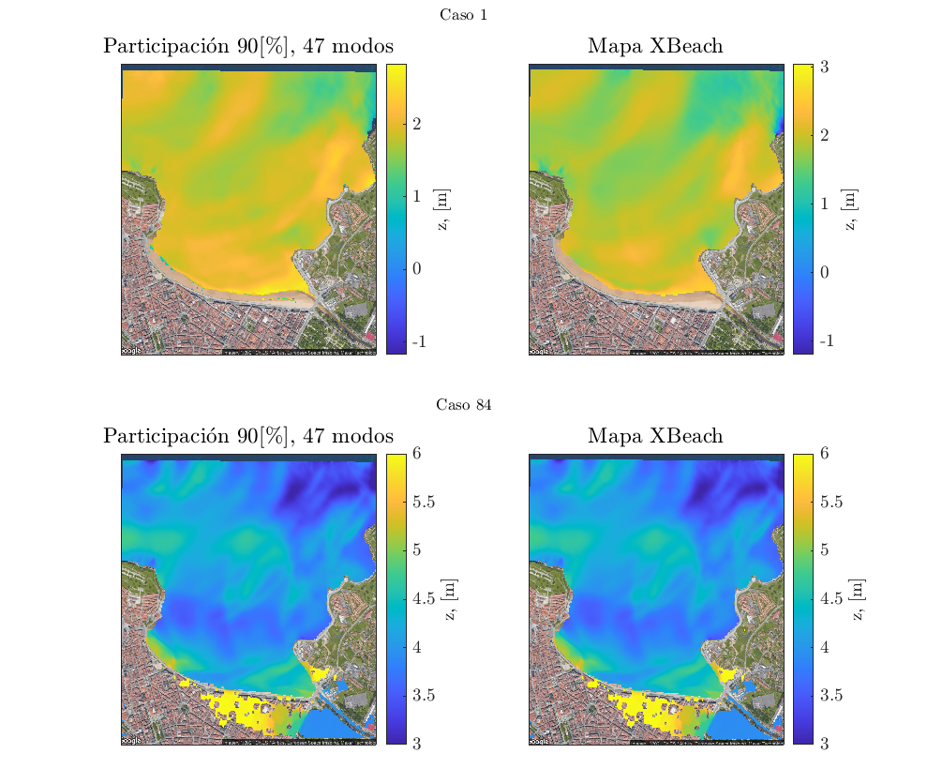

# Machine learning methods for coastal flooding
## Coastal flooding modelling strategies
The choice of the modelling strategy depends on the spatio-temporal scale to be solved. For spatial scales of few hundreds of meters, the direct option is to solve the surfzone hydrodynamics considering waves and water levels and subsequent overland flow using direct numerical simulation. However, for larger spatial scales, the wave and water level transformation problem is uncoupled from the overland flooding simulation to speed up the computations.

{width="50%" fig-align="center"}

For regional-scale applications, it is usual to solve the surfzone hydrodynamics using specific numerical tools to derive the coastal forcings for a reduced-complexity overland flood model as shown in Figure.

{width="50%" fig-align="center"}

## Limitations of numerical flooding prediction
However, in spite of the computational advantages of reduced-complexity process modeling, numerical modeling of coastal flooding has some limitations:
* Computational cost
* Compatibility with operational forecasting systems
* Probabilistic analysis
* Uncertainty analyses

## Problem statement
In order to overcome these limitations, machine learning is a great tool. However, the predictability problem implies that a spatial output (millions of points) needs to be predicted based on a reduced set of parameters describing the coastal forcings of the storm (wave height, period, direction and still water level).

$Y = F(X) \text{, where } Y \text{ is the spatial map and } X \text{ represents Hs, Tp, Dir, SWL.}$

{width="50%" fig-align="center"}

## Methodology
The methodology consists of creating a surrogate statistical model based on a set of numerical flood simulations. It is divided in several steps:
1. Numerical model setup
2. Extreme event selection
3. Numerical modeling
4. Statistical model training
5. Statistical model evaluation
### 1. Numerical model setup
A 2DH XBeach simulation in a 10x10m grid is setup considering both topobathymetry of the San Lorenzo beach in Gijón consisting of 45k numerical cells.

{width="50%" fig-align="center"}

### 2. Event selection
20 historical extreme events are selected considering a peaks over treshold (POT) method. 100 events are evaluated by combining the selected historical cases with 5 SLR scenarios.

{width="50%" fig-align="center"}

### 3. Numerical simulation
The numerical simulation of the 100 cases yields a training dataset consisting of 100 realizations of the 45k grid (representing the Y predictand variable) against the 100 wave and water level parameters representing the storms (X predictor variable).

{width="50%" fig-align="center"}

### 4. Training the statistical model
The statistical model consists of projecting the training predictand dataset (N=45000xM=100) into a reduced subset using principal component analysis (PCA).

$Y_{N,M}=U_{N,N} \Delta_{N,M} V_{M,M}$

{width="50%" fig-align="center"}

Then, a given flood map (Y) can be solved as a linear summation of fixed EOFs (U) multiplied by storm-dependent latent variables (PCs)

$Y_{j}=\sum_{i=1}^N \alpha_{ji}U_j$

Then, the spatial characteristics of the problem is represented by invariang EOFs and the inference problem is restricted to finding the storm-dependent latent variables that weights every EOF as a function of the storm characteristics which much more doable than the initial problem. The latent variables are inferred using Gaussian processes:

$\alpha_{ji}=GP(\underbrace{X}_{Hs, Tp, Dir, SWL})$

A balanced solution in terms of accuracy is obtained when choosing the EOFs that represent 90% of the total variance:

{width="50%" fig-align="center"}

### 5. Model evaluation
The surrogate GP model is evaluated against the true numerical solution and results highlight a slight underprediction of the total flooded area.

{width="50%" fig-align="center"}

### 6. Way forward
In order to improve the results we are exploring the following:
* Crop the training dataset to the inland area (main interest is overland flooding)
* Improve the GP surrogate model
* Test deep learning nonlinear projection techniques
* Test deep learning multioutput techniques
* Feel free to chat if you are curious or want to help!