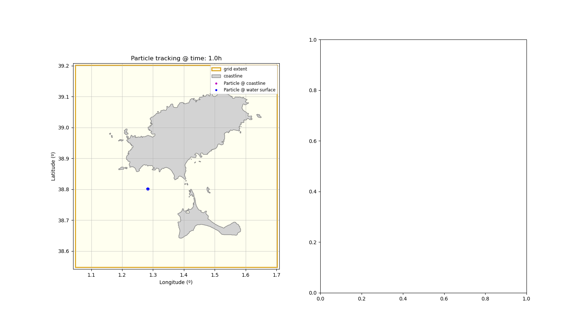

# Machine learning methods for coastal flooding
## Coastal flooding modelling strategies
The choice of the modelling strategy depends on the spatio-temporal scale to be solved. 

```{image} ../_static/images/flood_ms.png
:width: 500px
:align: center
```

## Limitations of numerical flooding prediction

## Problem statement

## Methodology

## 1 Numerical model setup

## 2 Event selection

## 3 Numerical simulation

## 4 Training the statistical model

## 5 Model evaluation

**Data assimilation** is a python package developed by [IHCantabria](https://ihcantabria.com/en/) to simplify and facilitate the setup and processing of [TESEO](https://ihcantabria.com/en/specialized-software/teseo/) simulations *(TESEO is a lagrangian numerical model also developed by IHCantabria.)* The soruce code of this package is located at [https://github.com/IHCantabria/pyteseo](https://github.com/IHCantabria/pyteseo).

```{image} ../_static/images/pyTESEO_logo.png
:width: 500px
:align: center
```
**Machine learning**
---

## Overview
pyTESEO is a python package developed to help users to setup TESEO's simulations. The package includes a bunch of use case examples in jupyter notebook format under the folder `notebooks` and a bunch of python functions grouped by submodules under the folder {py:mod}`pyteseo`. The package uses mainly numpy, pandas, matplotlib and xarray packages to manage and plot data. Based on these functions, the user can read and write all the necessary files to run a TESEO simulation, plot default figures of the results and export results to standard formats as CSV, JSON, netCDF, GeoJSON...

---

```{image} ../_static/images/TESEO_logo.png
:width: 300px
:align: left
:target: https://ihcantabria.com/en/specialized-software/teseo
```
TESEO is a lagrangian numerical model developed by IHCantabria. The numerical model calculates trajectories of particles based on metocean conditions like ocean currents, winds and waves. It also includes weathering submodels to evaluate the degradation and physical characteristics of specific substances or elements as floaters, oil, hns substances or marine litter.


```{important}
Marine litter submodel is currently under development!

```

Example of representation produced with pyTESEO



The soruce code of the model is located at [https://github.com/IHCantabria/TESEO](https://github.com/IHCantabria/TESEO).
More info about pyTESEO is provided at its [documentation](https://ihcantabria.github.io/pyteseo/)
