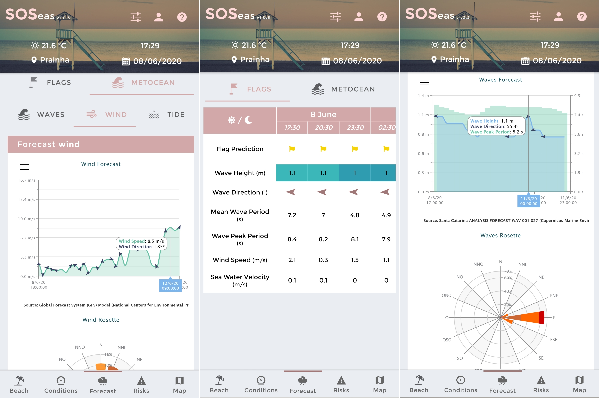
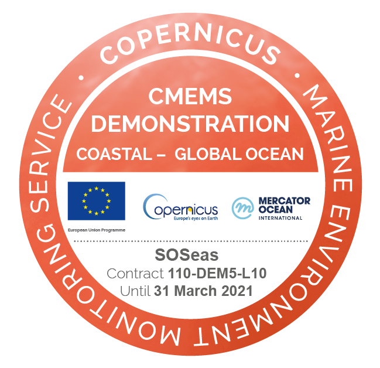

## SOSeas - Assessment tool for predicting the dynamic risk of drowning on beaches

🏖️ 🛟 🚩 `#electronic-flag` `#drowning` `#metocean` `#beach-safety` `#neuronal-network` `#deep-learning` 

---
### Context
Despite significant advancements in technology, techniques and knowledge, people still drown on the coast in unacceptable numbers; the maximum drowning index in Latin America is located in Brazil where a person is dead by drowning every 91 minutes. Against this backdrop, the following question arises: could we develop a worldwide operational system to inform end users about the risks at any patrolled or unpatrolled beach?

### Description
A new cutting-edge app is developed to minimize, predict and enhance useful information for beach users and related services and managers. Special focus on the generation of a elctronic flag to inform about drowning risk in patrol and unpatrol beaches, plus a warning section to notice user about other risks or important events that could take place in the beaches of Brazil. 

The main highlights of this app are metinoned bellow: 
1. A cross cutting analysis between metocean conditions, beach characterizations, and flag events catalogue. 
2. The use of Artificial Inteligence, specifically Deep Neural Network models, to identify and predict dynamic risk of drowning synchronized to dynamic metocean conditions.
3. Obtain electronic bathing flags as an indicator of this risk.
4. User-friendly display of the information: forecastings of metocean conditions (winds, waves, currents and tides) and electronic flag, beach charateristics (service locations mainly) and warnings related to metocean conditions or other factors (algae blooms, jellyfish...)

### End-Users
* 🏖️ 🛟 💼 Beach users, lifeguards and  managers can have detailed and near real-time information of all risks and their variability along the day.
* 🌊 🗺️ ⚠️ Providing information in a predictive manner would therefore help to minimize this risk factor by enabling a better management of these spaces.

 
<figure align="center">
    
    <figcaption><i>Figure 1 - Screenshots of SOSeas "Forecast" panel</i></figcaption>
</figure>
 
<figure align="center">
    
    <figcaption><i>Figure 2 - Screenshots of SOSeas "Events", "Map" and "Warnings" panels</i></figcaption>
</figure>

### Other Remarks
* Object of a scientific publication, doi: [10.5194/egusphere-egu2020-18033](https://doi.org/10.5194/egusphere-egu2020-18033)
* Other implementation done by IHCantabria in Australia ([Reference]())
* This project was founded by CMEMS DEMONSTRATION COASTAL-GLOBAL OCEAN (contract: 110-DEM5-L10) 

