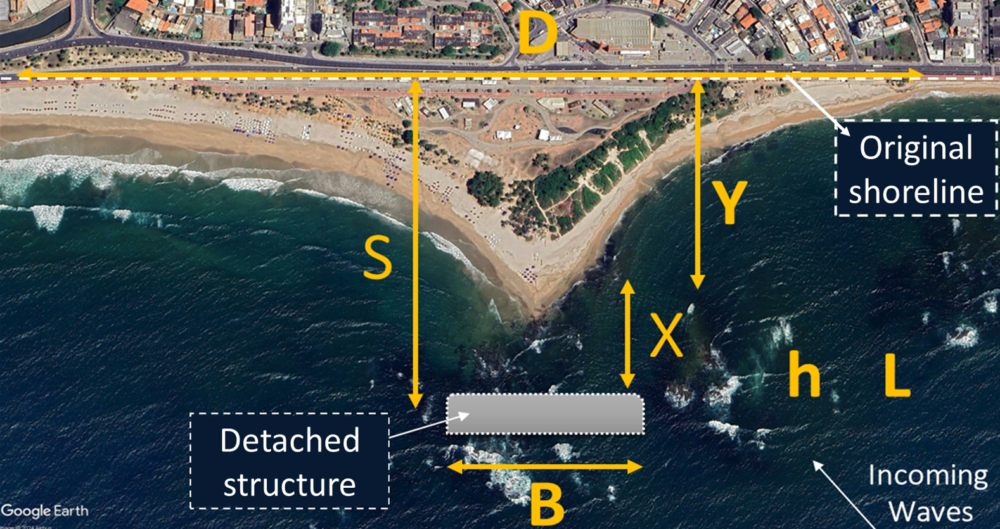
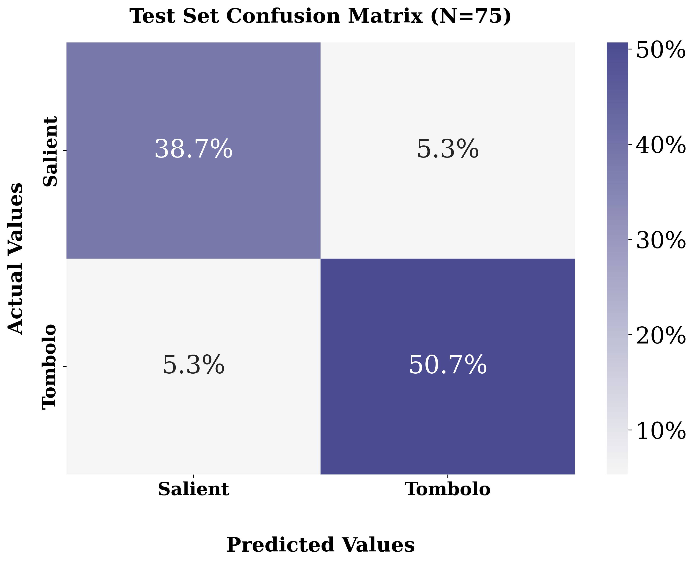

# Tombolo Formation Prediction

🏖️🧠 `#tombolo` `#salient` `#detached-breakwater` `#operational-system` `#shoreline` `#machine-learning`

---

## Overview

A global dataset of **detached coastal structures** has been compiled to facilitate the study of coastal dynamics and the impact of detached structures on shoreline morphology. It includes detailed information on various detached structures, their geometric and hydrodynamic parameters, and the resulting shoreline responses.

The features in the dataset includes:
- Geometric and hydrodynamic parameters such as:
  - Structure length (B), distance to shore (S), response size (Y)
  - Wave height (Hs), period (Tp), direction (EMWD), and wavelength (L)
- Classification labels for shoreline response: tombolo or salient
- Several structure typologies: emergent, low-crested, or submerged; breakwater, reef, or island

---

## Objectives

This work has been addressed with two approaches: as a binary classification problem (tombolo/salient) and as a regression problem (predicting the response size (Y)).

---

## Results

The results achieved with the final configurations of the machine learning models for both approaches were compared to state-of-the-art empirical formulas, showing a noticeable improvement in predictive accuracy and overall performance.

---

