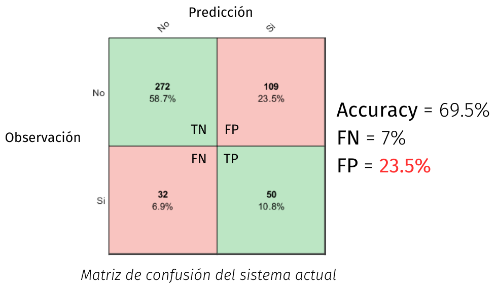
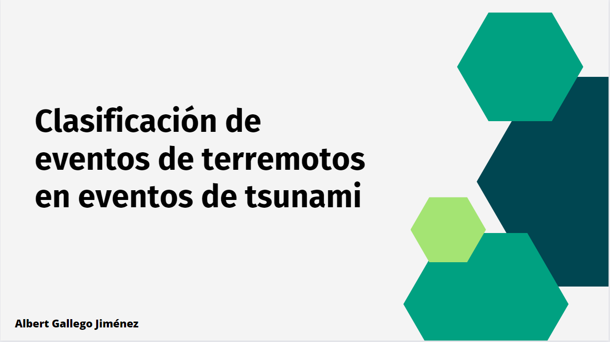
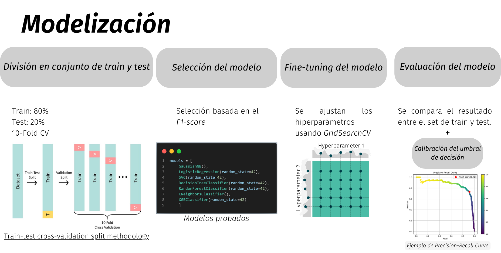
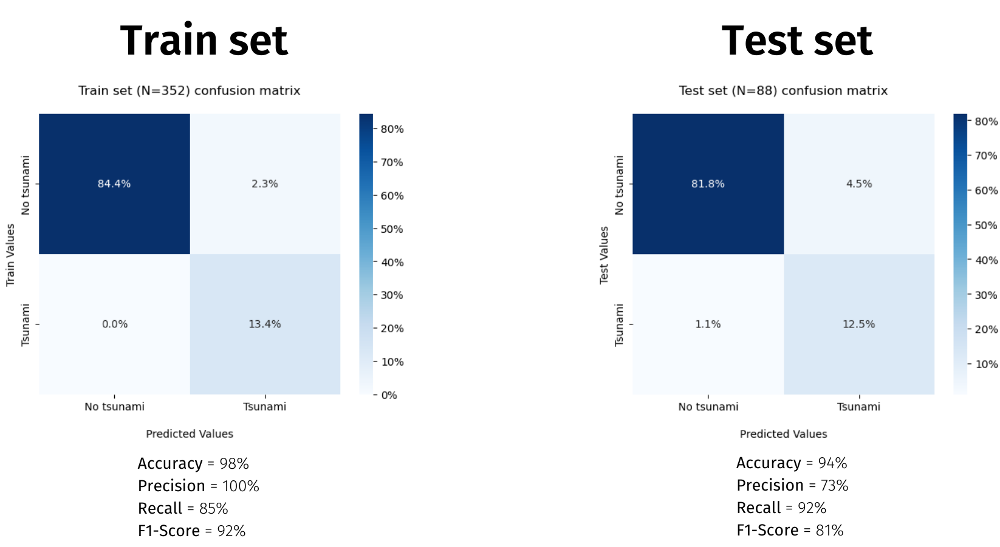
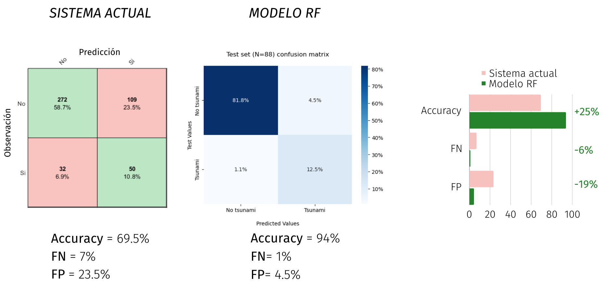

# TSUSY

**IH-Tsusy**  is a tsunami operational system designed to receive seismic information from the USGS. Using this data, the system assesses earthquake events to determine if they exhibit the necessary characteristics to trigger a tsunami. In the event of such a determination, IH-Tsusy performs numerical simulations of the tsunami's propagation. Subsequently, it delivers notifications through the app and presents interactive maps containing pertinent information. This includes data such as wave amplitude (or height) and travel times from the origin area to potentially affected coastal regions.

  

## Overview
The motivation of this work is mainly focused as a proposal to improve the current IH-Tsusy decision system to classify earthquake events into potential tsunamis.

The current system is based on the fulfillment of a criterion based on the evaluation of two parameters (focal depth and slip) of earthquake events. The thresholds of these parameters are defined under "expert judgment".

  

 

The full presentation of this work, carried out Nov 28th 2023 is available [here](https://www.canva.com/design/DAFbFyWc57c/ISjeqcPnOdLalJp-zXw_TQ/edit?utm_content=DAFbFyWc57c&utm_campaign=designshare&utm_medium=link2&utm_source=sharebutton).

  

## Modelling

The modelling methodology used is the following.

  

## Results

The following results are obtained by fine-tuning a Random Forest Classifier.

  

### Improvement of the current system
The improvements achieved comparing with current decision system are the following.

---
## More info

[Official website of the operational system](https://ihcantabria.com/specialized-software/ih-tsusy/)

[Web application](https://tsunami.ihcantabria.com/#/earthquakes)
